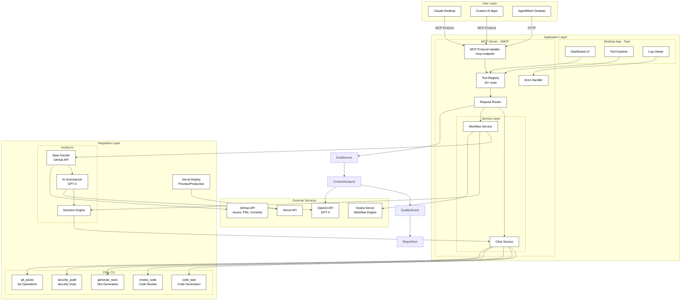
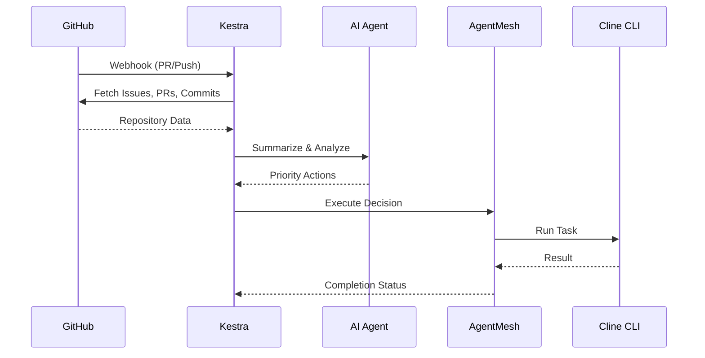

# 🤖 AgentMesh

> **The AI-Powered Software Development Automation Platform**
> 
> Orchestrate autonomous coding agents, intelligent workflows, and code quality evaluation through a unified MCP server.

[](https://vercel.com/new/clone?repository-url=https://github.com/N-45div/Agentmesh)
[](https://github.com/cline/cline)
[](https://kestra.io)
[](https://github.com/oumi-ai/oumi)
[](LICENSE)

## � What is AgentMesh?

AgentMesh is a **Model Context Protocol (MCP) server** that brings together the best AI development tools into one powerful platform:

- 🤖 **Cline CLI Integration** - Autonomous coding, code review, security audits, and test generation
- 🔄 **Kestra AI Workflows** - Intelligent pipelines that summarize data and make decisions
- 🧠 **Oumi LLM-as-a-Judge** - Code quality evaluation with custom judge configurations
- 🚀 **Vercel Deployment** - One-click deployment to production

## 📐 System Architecture



## 🛠️ Available Tools

### Core Cline Tools
| Tool | Description |
|------|-------------|
| `cline_status` | Check Cline CLI installation status |
| `code_task` | Execute any coding task with Cline |
| `review_code` | AI-powered code review |
| `fix_issues` | Automatically fix code issues |
| `generate_tests` | Generate unit/integration tests |
| `security_audit` | Perform security vulnerability scan |
| `explain_code` | Get AI explanations of code |
| `refactor` | Refactor code for better quality |
| `generate_docs` | Generate documentation |
| `git_assist` | AI-assisted Git operations |

### Deployment & CI/CD
| Tool | Description |
|------|-------------|
| `vercel_deploy` | Deploy to Vercel (preview/production) |
| `scaffold_project` | Scaffold new projects with AI |

### Workflow Orchestration
| Tool | Description |
|------|-------------|
| `agent_workflow` | Multi-step AI agent pipelines |
| `kestra_code_intel` | Kestra AI Agent for code intelligence |

## 🧠 Kestra AI Integration

AgentMesh integrates with **Kestra** for intelligent workflow orchestration and AI-powered data summarization.



### How It Works

1. **Data Collection** - Kestra fetches issues, PRs, and commits from GitHub
2. **AI Summarization** - Kestra's AI Agent analyzes and summarizes the data
3. **Decision Making** - AI decides what actions to take based on priorities
4. **Execution** - Triggers Cline via AgentMesh to execute fixes automatically

### Quick Start with Kestra

```bash
# Start Kestra
docker run -p 8080:8080 kestra/kestra:latest server local

# Import the workflow
# Copy kestra/agentmesh-code-intel.yml to Kestra UI
```

See [`kestra/agentmesh-code-intel.yml`](./kestra/agentmesh-code-intel.yml) for the complete workflow.


## 🚀 Quick Start

### Prerequisites

- Node.js 18+
- [Cline CLI](https://github.com/cline/cline) installed and configured
- pnpm (recommended)

### Installation

```bash
# Clone the repository
git clone https://github.com/yourusername/agentmesh.git
cd agentmesh

# Install dependencies
pnpm install

# Start development server
pnpm dev
```

The MCP server will be running at `http://127.0.0.1:3001/mcp`

### Test the Server

```bash
# List available tools
curl -X POST http://127.0.0.1:3001/mcp \
  -H "Content-Type: application/json" \
  -H "Accept: application/json" \
  -d '{"jsonrpc":"2.0","id":1,"method":"tools/list"}'

# Check Cline status
curl -X POST http://127.0.0.1:3001/mcp \
  -H "Content-Type: application/json" \
  -H "Accept: application/json" \
  -d '{"jsonrpc":"2.0","id":2,"method":"tools/call","params":{"name":"cline_status","arguments":{}}}'
```

## 🌐 Deploy to Vercel

```bash
# Install Vercel CLI
npm i -g vercel

# Deploy
vercel deploy
```

## 🔧 Configuration

### Environment Variables

```bash
# Optional: Custom Cline CLI path
CLINE_PATH=/path/to/cline

# For Oumi Judge integration
OPENAI_API_KEY=your-openai-key  # For Oumi judge model

# For Kestra integration
KESTRA_URL=http://localhost:8080
```


## 📄 License

MIT License - see [LICENSE](LICENSE) for details.

## 🧠 Oumi LLM-as-a-Judge Integration

As part of AgentMesh submission I contributed configs to the Oumi open-source project.

### Custom Judge Configs

PR link : [Oumi LLM as a judge for Code quality PR](https://github.com/oumi-ai/oumi/pull/2087)

Located in `configs/projects/judges/code/`:

| Config | Purpose |
|--------|---------|
| `maintainability.yaml` | Evaluates code maintainability, readability, and documentation |
| `security.yaml` | Assesses security vulnerabilities and best practices |
| `performance.yaml` | Analyzes performance characteristics and optimizations |

## � CLI Review Script

Run code reviews directly from the command line with output to markdown files:

```bash
# Code review a file
./scripts/review.sh review src/lib/cline.ts

# Security audit
./scripts/review.sh audit .

# Generate tests
./scripts/review.sh tests src/tools/security-audit.ts
```

Reviews are saved to `./reviews/` as markdown files with timestamps.

## �🙏 Acknowledgments

- [Cline](https://github.com/cline/cline) - The autonomous coding agent
- [XMCP](https://xmcp.dev) - The MCP framework
- [Vercel](https://vercel.com) - Deployment platform
- [Kestra](https://kestra.io) - Workflow orchestration
- [Oumi](https://github.com/oumi-ai/oumi) - LLM-as-a-Judge framework

---

Built with ❤️ for the AI Agents Hackathon using [Cline CLI](https://github.com/cline/cline), [Kestra](https://kestra.io), and [Oumi](https://github.com/oumi-ai/oumi)
