# 🤖 AgentMesh

> **Unified AI Agent Orchestration Platform**
> 
> Connect any MCP-compatible AI assistant to autonomous coding agents, workflow orchestration, and intelligent code evaluation.

[](https://vercel.com/new/clone?repository-url=https://github.com/N-45div/Agentmesh)
[](https://oumi.ai)
[](https://kestra.io)
[](LICENSE)

## 🎯 What is AgentMesh?

AgentMesh is a **Model Context Protocol (MCP) server** that unifies multiple AI capabilities into a single, powerful platform:

- 🤖 **Autonomous Coding** - Execute complex coding tasks via Cline CLI
- 🔄 **Workflow Orchestration** - Intelligent pipelines with Kestra AI
- 🎯 **Quality Evaluation** - LLM-as-a-Judge scoring with Oumi
- 🚀 **One-Click Deployment** - Deploy anywhere with Vercel integration

## 📐 System Architecture

```mermaid
graph TB
    subgraph Clients["🖥️ MCP Clients"]
        Claude["Claude Desktop"]
        Custom["Custom AI Apps"]
        Desktop["AgentMesh Desktop"]
    end
    
    subgraph AgentMesh["⚡ AgentMesh Server"]
        MCP["MCP Protocol Layer"]
        Tools["Tool Registry"]
        Router["Request Router"]
    end
    
    subgraph Integrations["🔌 Integrations"]
        Cline["Cline CLI"]
        Kestra["Kestra Workflows"]
        Oumi["Oumi Judge"]
        Vercel["Vercel Deploy"]
    end
    
    subgraph Actions["🎬 Actions"]
        Code["Code Generation"]
        Review["Code Review"]
        Test["Test Generation"]
        Security["Security Audit"]
        Deploy["Deployment"]
    end
    
    Clients --> MCP
    MCP --> Tools
    Tools --> Router
    Router --> Integrations
    Integrations --> Actions
```



## 🛠️ Available Tools

### Core Cline Tools
| Tool | Description |
|------|-------------|
| `cline_status` | Check Cline CLI installation status |
| `code_task` | Execute any coding task with Cline |
| `review_code` | AI-powered code review |
| `fix_issues` | Automatically fix code issues |
| `generate_tests` | Generate unit/integration tests |
| `security_audit` | Perform security vulnerability scan |
| `explain_code` | Get AI explanations of code |
| `refactor` | Refactor code for better quality |
| `generate_docs` | Generate documentation |
| `git_assist` | AI-assisted Git operations |

### Deployment & CI/CD
| Tool | Description |
|------|-------------|
| `vercel_deploy` | Deploy to Vercel (preview/production) |
| `oumi_judge` | LLM-as-a-Judge for rating outputs |
| `scaffold_project` | Scaffold new projects with AI |

### Workflow Orchestration
| Tool | Description |
|------|-------------|
| `agent_workflow` | Multi-step AI agent pipelines |
| `kestra_code_intel` | Kestra AI Agent for code intelligence |

## 🧠 Kestra AI Integration

AgentMesh integrates with **Kestra** for intelligent workflow orchestration and AI-powered data summarization.


### How It Works

1. **Data Collection** - Kestra fetches issues, PRs, and commits from GitHub
2. **AI Summarization** - Kestra's AI Agent analyzes and summarizes the data
3. **Decision Making** - AI decides what actions to take based on priorities
4. **Execution** - Triggers Cline via AgentMesh to execute fixes automatically

### Quick Start with Kestra

```bash
# Start Kestra
docker run -p 8080:8080 kestra/kestra:latest server local

# Import the workflow
# Copy kestra/agentmesh-code-intel.yml to Kestra UI
```

See [`kestra/agentmesh-code-intel.yml`](./kestra/agentmesh-code-intel.yml) for the complete workflow.

## 🎯 Oumi LLM-as-a-Judge Integration

AgentMesh uses **Oumi's LLM-as-a-Judge** to evaluate and score all tool outputs:


### Evaluation Criteria

| Criteria | What It Checks |
|----------|----------------|
| **code-quality** | Structure, readability, best practices |
| **security** | Vulnerabilities, input validation |
| **performance** | Efficiency, complexity |
| **correctness** | Logic accuracy, error handling |
| **maintainability** | Documentation, modularity |

### Usage Example

```bash
# Evaluate Cline output
curl -X POST http://127.0.0.1:3001/mcp \
  -H "Content-Type: application/json" \
  -d '{
    "jsonrpc": "2.0",
    "id": 1,
    "method": "tools/call",
    "params": {
      "name": "oumi_judge",
      "arguments": {
        "action": "evaluate",
        "content": "function add(a, b) { return a + b; }",
        "criteria": "all"
      }
    }
  }'
```

## 🚀 Quick Start

### Prerequisites

- Node.js 18+
- [Cline CLI](https://github.com/cline/cline) installed and configured
- pnpm (recommended)

### Installation

```bash
# Clone the repository
git clone https://github.com/yourusername/agentmesh.git
cd agentmesh

# Install dependencies
pnpm install

# Start development server
pnpm dev
```

The MCP server will be running at `http://127.0.0.1:3001/mcp`

### Test the Server

```bash
# List available tools
curl -X POST http://127.0.0.1:3001/mcp \
  -H "Content-Type: application/json" \
  -H "Accept: application/json" \
  -d '{"jsonrpc":"2.0","id":1,"method":"tools/list"}'

# Check Cline status
curl -X POST http://127.0.0.1:3001/mcp \
  -H "Content-Type: application/json" \
  -H "Accept: application/json" \
  -d '{"jsonrpc":"2.0","id":2,"method":"tools/call","params":{"name":"cline_status","arguments":{}}}'
```

## 🌐 Deploy to Vercel

```bash
# Install Vercel CLI
npm i -g vercel

# Deploy
vercel deploy
```

## 🔧 Configuration

### Environment Variables

```bash
# Optional: Custom Cline CLI path
CLINE_PATH=/path/to/cline

# For Oumi Judge integration
OPENAI_API_KEY=your-openai-key  # For Oumi judge model

# For Kestra integration
KESTRA_URL=http://localhost:8080
```

## 📖 Deployment Options

AgentMesh provides **three ways** to use the MCP server:

| Option | Best For | How It Works |
|--------|----------|--------------|
| 🖥️ **Desktop App** | Daily development | Native GUI with built-in MCP server |
| 🔄 **CI/CD Pipeline** | Automated workflows | GitHub Actions + Kestra on every push/PR |
| 🌐 **Local Server** | Custom integrations | Connect any MCP client (Claude, etc.) |

## 🖥️ Desktop App

The AgentMesh Desktop app provides a native GUI for running the MCP server locally with full Cline CLI support.

### Features
- **Start/Stop MCP Server** with one click
- **Execute tools** with visual feedback
- **Real-time logs** display
- **Cline CLI status** indicator

### Build Desktop App

```bash
cd desktop
pnpm install
pnpm tauri:dev    # Development
pnpm tauri:build  # Production build
```

Requires [Rust](https://rustup.rs/) and [Tauri prerequisites](https://tauri.app/v1/guides/getting-started/prerequisites).

## 🔄 GitHub Action

AgentMesh includes a GitHub Action that automatically analyzes your repository on every push/PR:

```yaml
# .github/workflows/code-intelligence.yml
# Triggers automatically on push/PR to main
```

### What it does:
1. **Fetches** open issues, PRs, and recent commits
2. **Analyzes** repository health with AI
3. **Triggers Kestra** workflow for automated fixes (if configured)
4. **Posts summary** as PR comment

## 🎬 Demo

[Watch the demo video](https://youtube.com/your-demo-link)

## 📄 License

MIT License - see [LICENSE](LICENSE) for details.

## 🙏 Acknowledgments

- [Cline](https://github.com/cline/cline) - The autonomous coding agent
- [XMCP](https://xmcp.dev) - The MCP framework
- [Vercel](https://vercel.com) - Deployment platform
- [Oumi](https://oumi.ai) - LLM-as-a-Judge evaluation framework
- [Kestra](https://kestra.io) - Workflow orchestration

---

Built with ❤️ using [XMCP](https://xmcp.dev), [Cline](https://github.com/cline/cline), [Kestra](https://kestra.io), and [Oumi](https://oumi.ai)
